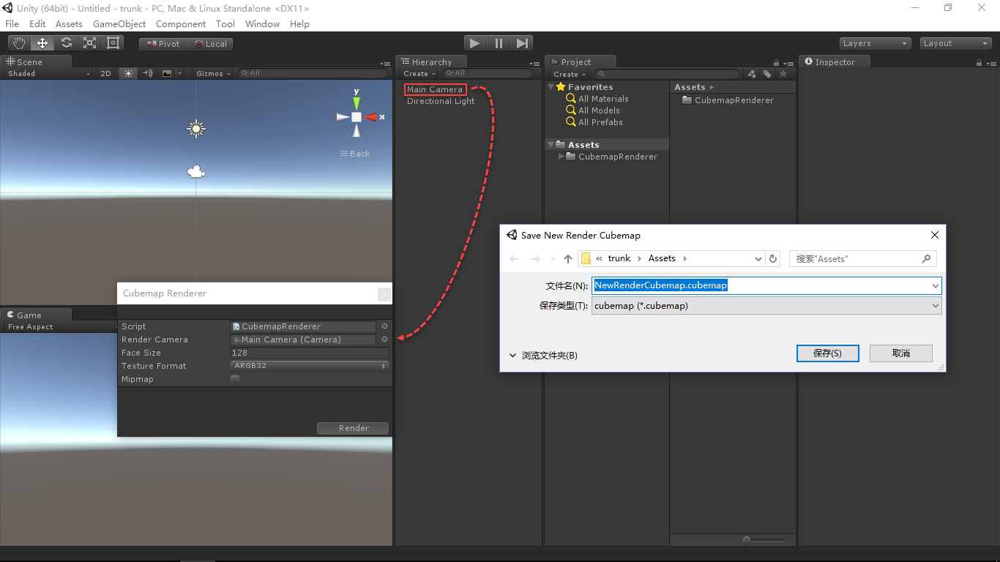
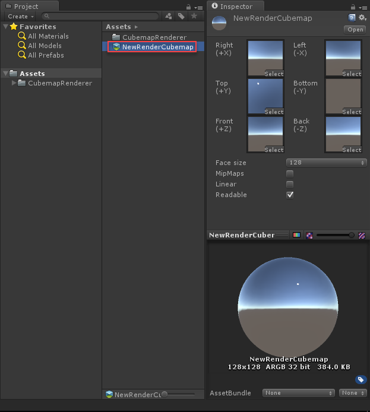

# CubemapRenderer
- [中文手册](./README_ZH.md)

## Summary
- Unity Cubemap renderer.

## Demand
- Render a scene into a static Cubemap asset for Skybox material or reflective material.

## Environment
- Unity 5.0 or above.
- .Net Framework 3.0 or above.

## Prerequisite
- Unity provide the ScriptableWizard class to quickly create extend editor window.
- Unity provide the API(RenderToCubemap method of the Camera class) to render Cubemap.

## Scheme
- Write extend editor code, select source camera and config the parameters for create Cubemap.
- Select path and input file name to save the render Cubemap.

## Achieve
- CubemapRenderer : Draw extend editor window and render scene into a static Cubemap asset.

## Preview
- Cubemap Renderer

- New Render Cubemap

## Contact
- If you have any questions, feel free to contact me at mogoson@qq.com.