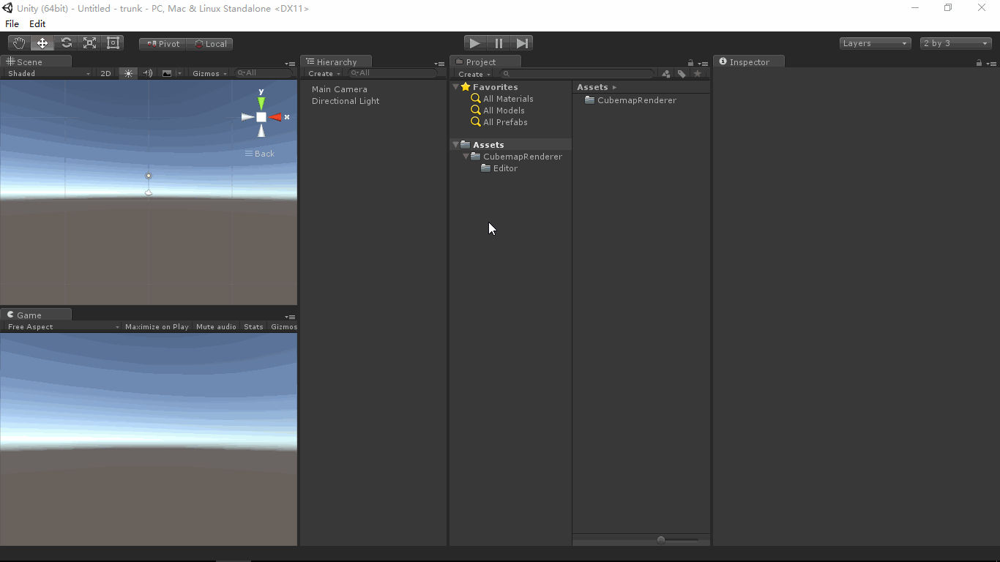

# CubemapRenderer
- [English Manual](./README.md)

## 概述
- Unity Cubemap渲染器。

## 需求
- 有时，发现一些Unity资源包中的场景的环境效果不错，希望将其渲染成Cubemap供天空盒使用。
- Unity场景中需要制作一些反射效果的材质，例如玻璃，金属等，需要将场景渲染成Cubemap，
  结合反射Shader表现效果。

## 环境
- Unity 5.0 或更高版本。
- .Net Framework 3.0 或更高版本。

## 条件
- Unity提供ScriptableWizard类快速创建简易扩展编辑器窗口。
- Unity提供Camera.RenderToCubemap方法渲染Cubemap。

## 方案
- 编写扩展编辑器窗口，指定目标渲染摄像机（渲染细节调节摄像机参数即可）。
- 选择保存路径，输入文件名，渲染场景到Cubemap文件。

## 实现
- CubemapRenderer：绘制扩展编辑器窗口，渲染场景到Cubemap中。

## 图示
- Cubemap Renderer

## 联系
- 如果你有任何问题或者建议，欢迎通过mogoson@qq.com联系我。